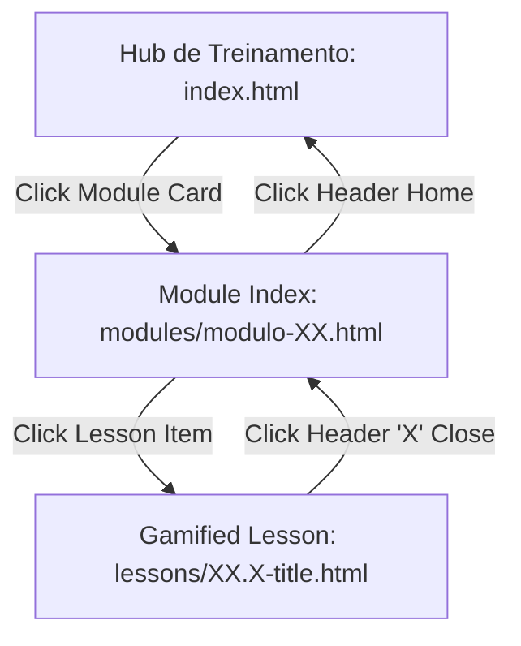

# Product Requirement Document (PRD) — CyberDuo 🛡️

This document describes the product features, user flows, game mechanics, and DOM structures of **CyberDuo** to facilitate smart automated E2E test generation in **TestSprite**.

---

## 1. Product Overview

**CyberDuo** is a gamified, client-side educational platform for Ethical Hacking and Offensive Security. It is structured into multiple learning modules, each containing highly interactive gamified lessons designed to validate cybersecurity concepts through interactive exercises.

### Technical Stack
*   **Frontend**: Vanilla HTML5, Client-side ES6 JavaScript.
*   **Styling**: Vanilla CSS custom variables, Tailwind CSS classes, FontAwesome (v6.4.0) for icons.
*   **Data Flow**: 100% local, self-contained lesson JSON structures rendered dynamically via JavaScript loops. No backend state dependencies, making it extremely fast to test.

---

## 2. Navigation Architecture & User Flows

The application follows a strict hierarchical tree structure:

### Core User Flows to Test

1.  **Hub-to-Lesson Navigation Flow**:
    *   Start at `index.html`.
    *   Click on a `.module-card` (e.g., Module 7).
    *   Arrive at `modules/modulo-07.html`.
    *   Click on a `.submodule-item` (e.g., Lesson 7.1a).
    *   Arrive at `lessons/7.1a-cloud.html`.
2.  **Lesson Completion Flow (Happy Path)**:
    *   Navigate through `teach` and `example` screens clicking **"Continuar"**.
    *   Identify interactive step (`quiz` or `fill` or `match`).
    *   Input correct choices/pairs.
    *   Click **"Verificar"** (Verify), confirm green overlay (`#feedbackPopup.correct`), and click **"Continuar"** to advance.
    *   Reach the **Victory Screen** showing the Medal icon (`.fa-medal` or similar) and victory text.
    *   Click **"Próxima Lição"** (Next Lesson) to advance or **"Módulos"** to return to module index.
3.  **Lesson Defeat Flow (Game Over Path)**:
    *   Intentionally input wrong answers on interactive screens.
    *   Verify that `#heartsContainer` decreases its active hearts from 5 down to 0.
    *   Triggering 0 hearts must throw a browser `alert("VOCÊ FICOU SEM VIDAS. O treinamento será reiniciado.")`.
    *   Confirming the alert triggers a `location.reload()` resetting the lesson state.

---

## 3. Game Mechanics & State Machine

Each lesson file contains a self-contained JavaScript engine governing the lesson loop.

### State Parameters
*   `currentStep` (Integer, 0-indexed): Index of the current step from the `steps` array.
*   `hearts` (Integer, default `5`): Remaining user lives.
*   `selectedIdx` (Integer/null): Track currently active user choices before verification.

---

### Step Types & Expected Actions

| Step Type | UI Presentation | Allowed Actions | Verification Trigger |
| :--- | :--- | :--- | :--- |
| **`teach`** | Concept text slide with a bulleted bulb highlight. | Click `checkBtn` (**"Continuar"**). | Immediately advances `currentStep++` and renders next step. No feedback popup. |
| **`example`** | Practical scenario slide with an interactive terminal/code box (`.example-code`). | Click `checkBtn` (**"Continuar"**). | Immediately advances `currentStep++` and renders next step. No feedback popup. |
| **`quiz`** | Question text with multiple-choice list cards (`.option-card`). | Click an option card (`#opt-X`). This enables the **"Verificar"** button. | Click `checkBtn`. Correct choice displays green `#feedbackPopup.correct`. Incorrect choice deducts 1 heart and displays red `#feedbackPopup.wrong`. |
| **`fill`** | A sentence with a missing slot (`#fillSlot`) and option cards. | Click an option card (`#opt-X`) to place it in the slot. Enables the **"Verificar"** button. | Click `checkBtn`. Correct choice displays green `#feedbackPopup.correct`. Incorrect choice deducts 1 heart and displays red `#feedbackPopup.wrong`. |
| **`match`** | Dynamic side-by-side card grid. Left side (terms), right side (definitions). | Click a left-side item (`#left-X`), then click a right-side item (`#right-Y`). | Automatic upon clicking a pair. Correct match: permanent green highlights (`.matched`), disables cards. Incorrect match: temporary red highlights (`.error`), deducts 1 heart. **"Verificar"** button only appears/enables once *all* pairs are matched. |

---

## 4. DOM Selectors & Selector Mapping

For automated E2E testing tools like **TestSprite**, use the following element selectors:

### Global Header Components (Inside Lesson Screen)
*   **Close Button**: `.game-header div[onclick*="modules/"]` (Closes lesson, redirects back).
*   **Progress Bar**: `.progress-container` / `#progressFill` (The width style transitions from `0%` to `100%` as `currentStep` increases).
*   **Hearts System**: `#heartsContainer` (Contains active `<i class="fas fa-heart"></i>` and empty `<i class="far fa-heart"></i>` icons).

### Main Interaction Area
*   **Main Container**: `#gameArea` (Dynamically re-rendered using `render()` on every step).
*   **Step Title**: `.title-main` / `.quiz-title`.
*   **Paragraphs/Scenarios**: `.text-body` / `.example-scenario` / `.fill-sentence`.
*   **Options Grid**: `.options-grid`.
*   **Individual Cards**: `.option-card` / `[id^="opt-"]` (quiz/fill selections).
*   **Pair Matching Items**: `[id^="left-"]` (Left terms) and `[id^="right-"]` (Right definitions).

### Feedback Overlay Popup
*   **Popup Wrapper**: `#feedbackPopup` / `.feedback-overlay` (Becomes visible by adding the `.show` class. Class `.correct` added for correct answers, `.wrong` for incorrect answers).
*   **Popup Title**: `#fbTitle` (Contains check/times icon and validation text).
*   **Popup Explanation**: `#fbMsg` (Explains the concept behind the answer).
*   **Popup Action Button**: `#feedbackPopup button[onclick="handleContinue()"]` (Dismisses popup and advances slide).

### Footer Action Area
*   **Action Button**: `#checkBtn` / `.check-btn` (Disabled by default on quizzes/fills until a choice is selected. Activated with `.active` class. Text changes dynamically between **"Verificar"** and **"Continuar"**).

---

## 5. Victory Screen DOM Elements

Upon completing the final step, `#gameArea` is injected with the victory screen:
*   **Medal Icon**: `.fa-medal` (Visible indicator of success).
*   **Success Title**: `.title-main` (e.g., "SEGREDOS EXTRAÍDOS!", "PERSISTÊNCIA CONCLUÍDA!").
*   **Next Lesson Button**: `a.check-btn.active` or `button.check-btn.active` (Contains redirect link, e.g., `onclick="window.location.href='../lessons/...'"`).
*   **Restart Button**: `button[onclick="location.reload()"]` or `button[onclick="recomessar()"]` (Restarts current lesson).
*   **Modules Index Button**: `button[onclick*="modules/modulo-"]` (Returns to module catalog).
